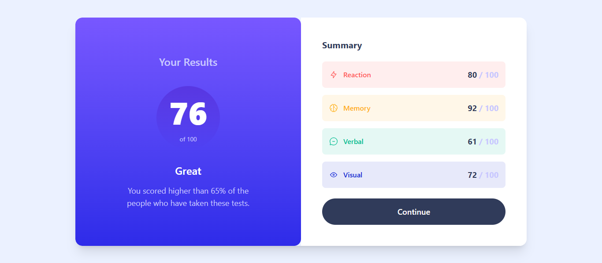

# Frontend Mentor - Results Summary Component Solution

This is my solution to the [Results Summary Component Challenge on Frontend Mentor](https://www.frontendmentor.io/challenges/results-summary-component-CE_K6s0maV). This project strengthened my skills in building responsive layouts, working with JSON data in React, and using Tailwind CSS effectively.

## Table of contents

- [Overview](#overview)
  - [The challenge](#the-challenge)
  - [Screenshot](#screenshot)
  - [Links](#links)
- [My process](#my-process)
  - [Built with](#built-with)
  - [What I learned](#what-i-learned)
  - [Continued development](#continued-development)
  - [Useful resources](#useful-resources)
- [Author](#author)

## Overview

### The challenge

Users should be able to:

- View the optimal layout for the interface depending on their device's screen size.
- See hover and focus states for all interactive elements.
- Dynamically populate the summary content from a local JSON file.

### Screenshot



### Links

- **Solution URL:** [https://github.com/amikoelvis/Results-Summary-Component](https://github.com/amikoelvis/Results-Summary-Component)
- **Live Site URL:** [https://results-summary-component-plum-one.vercel.app/](https://results-summary-component-plum-one.vercel.app/)

## My process

### Built with

- Semantic HTML5
- Tailwind CSS
- Flexbox and Grid
- React (with functional components)
- TypeScript
- Mobile-first responsive workflow
- Local JSON data fetching

### What I learned

This project allowed me to:

- Create a fully responsive layout using Tailwind utility classes.
- Implement a two-column layout at `max-w-5xl` for desktop views.
- Dynamically populate components with local JSON data using `fetch`.
- Improve component reusability with TypeScript interfaces.
- Add keyboard and accessibility improvements.

#### Code Example

```tsx
useEffect(() => {
  const fetchData = async () => {
    try {
      const res = await fetch("./data.json");
      const data: ResultsSummaryProps[] = await res.json();
      setSummaryData(data);
    } catch (err) {
      console.error("Error fetching data:", err);
    }
  };
  fetchData();
}, []);
```

### Continued development

- Add animations using Framer Motion.
- Refactor components into a reusable component library.
- Improve accessibility by incorporating ARIA roles and better semantic markup.
- Write unit and integration tests with React Testing Library.-

### Useful resources

- [TypeScript with React](https://react.dev/learn/typescript) - This helped me for mastering TypeScript with React. I really liked this pattern and will use it going forward.
- [Tailwind CSS Documentation](https://tailwindcss.com/docs) - This helped me with the styling.

## Author

- Website - [Amiko Elvis](https://results-summary-component-plum-one.vercel.app/)
- Frontend Mentor - [@amikoelvis](https://www.frontendmentor.io/profile/amikoelvis)
- Twitter - [@ElvisAmiko](https://www.twitter.com/ElvisAmiko)

## Acknowledgments

Thank you to Frontend Mentor!
